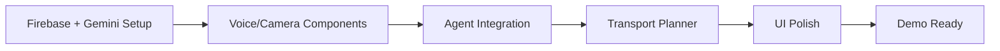

# Namma Guide - 4 Hour Timeline

## Overview
**Start Time:** 11:40 AM  
**End Time:** 3:40 PM  
**Goal:** Working MVP with voice translation, camera vision, and transport planning

---

## Hour 1: Core Foundation (11:40 - 12:40)

### Tasks
1. **Initialize Next.js 15 frontend**
   - Create Next.js app with TypeScript and Tailwind
   - Install dependencies (@google/generative-ai, Firebase, shadcn/ui)
   - Setup basic routing and layout

2. **Initialize FastAPI backend**
   - Create Python virtual environment
   - Install FastAPI, Uvicorn, Firebase Admin SDK
   - Create basic app structure with health endpoint

3. **✅ Create mock API services** [DONE]
   - Mock ONDC (mobility + food discovery)
   - Mock Razorpay (payment orders)
   - Mock Mappls (routing)
   - Mock GTFS (BMTC + Metro)

4. **Firebase Setup**
   - Create Firebase project
   - Enable Google Auth
   - Initialize Firestore
   - Configure frontend and backend

5. **Gemini Client Setup**
   - Get Gemini API key
   - Create Gemini client wrapper
   - Test basic prompt

---

## Hour 2: Voice + Vision (12:40 - 13:40)

### Tasks
1. **Camera Component**
   - MediaDevices API integration
   - Capture and preview
   - Send to Gemini Vision

2. **Voice Component**
   - MediaRecorder API / Web Speech API
   - Record audio
   - Send to Gemini Audio

3. **Basic Agents**
   - Vision Agent (Gemini Flash Vision)
   - Audio Agent (Gemini Audio)
   - Translation Agent (Gemini Pro)
   - Orchestrator to route requests

4. **Home Screen UI**
   - Large mic button
   - Camera button
   - Chat interface for responses

---

## Hour 3: Transport & Discovery (13:40 - 14:40)

### Tasks
1. **Transport Planner**
   - Input: origin + destination
   - Call mock Mappls + GTFS
   - Display multimodal routes (Bus + Metro + Auto)

2. **Route Display**
   - Route cards with time/cost/transfers
   - Map view (simple Leaflet map)
   - Book button (mock payment)

3. **Discovery Mode**
   - Camera → "What's good here?"
   - Call mock ONDC for food/places
   - Display search results

4. **Memory Integration**
   - Save user preferences to Firestore
   - Save conversation history

---

## Hour 4: Polish & Testing (14:40 - 15:40)

### Tasks
1. **UI Polish**
   - Dark mode theme
   - Kannada font (Noto Sans Kannada)
   - Loading states
   - Error handling

2. **Testing Flows**
   - Voice translation: English → Kannada
   - Camera OCR: Photo → Text extraction
   - Transport: Route planning with mock data

3. **Demo Preparation**
   - Record demo video
   - Screenshots
   - README updates

4. **Bug Fixes**
   - Fix any breaking issues
   - Improve error messages

---

## Critical Path

---

## Minimum Viable Demo

By 3:40 PM, you should be able to:

1. ✅ **Voice Translation**
   - Click mic → speak "How much to Jayanagar?" → hear Kannada response

2. ✅ **Camera Vision**
   - Click camera → point at text → see OCR result + translation

3. ✅ **Transport Planning**
   - Enter "Koramangala to Whitefield" → see BMTC + Metro routes → mock booking

---

## Contingency Plans

**If behind schedule:**

- **Skip:** PWA manifest, real payment flow, multi-language UI
- **Keep:** Voice, camera, transport planner (core demo)

**If ahead of schedule:**

- Add: Expense tracking, better UI animations, deploy to Vercel

---

## Current Status

- ✅ Mock APIs created
- ⏳ Waiting for Firebase + Gemini setup
- ⏳ Starting Hour 1 implementation
